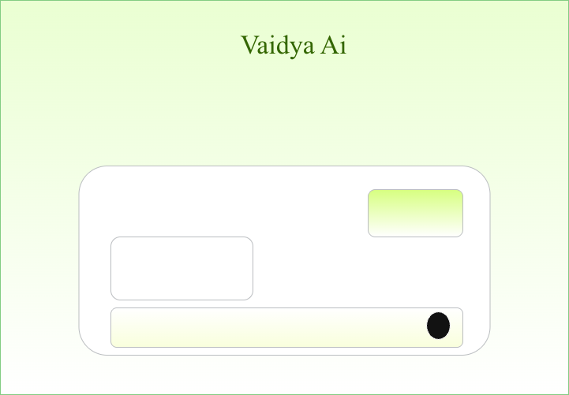
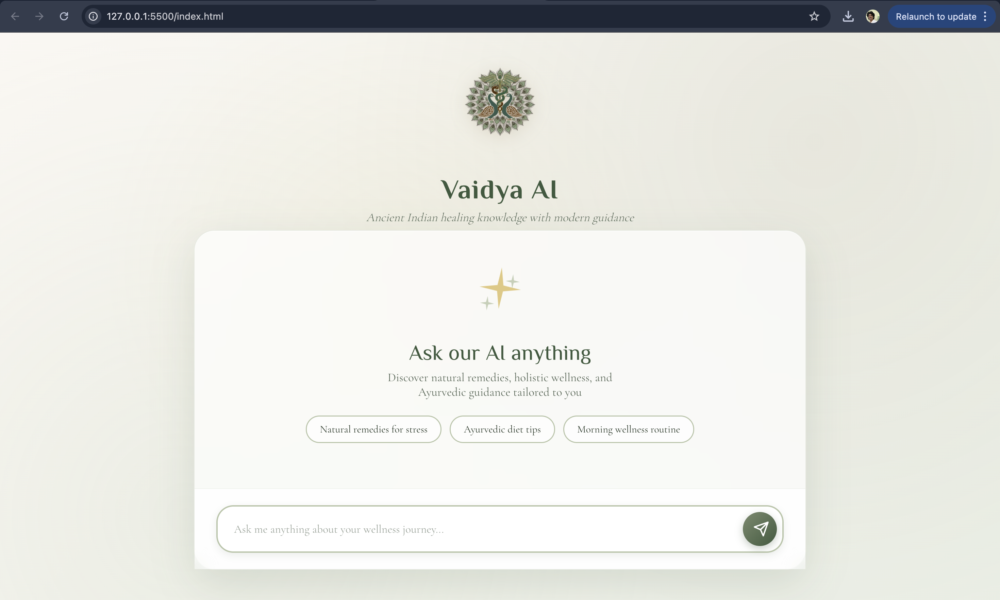
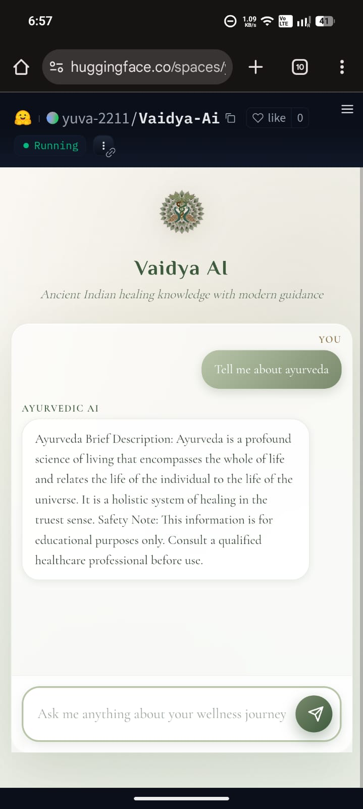

# 🌿 Vaidya AI: Ayurvedic RAG Chatbot

**Vaidya AI** is an intelligent Retrieval-Augmented Generation (RAG) system designed to provide authentic Ayurvedic insights and Indian home remedies. By combining ancient wisdom with modern AI, it retrieves data from curated texts to provide structured, reliable health education.

---

## ️ System Architecture

The system follows a modular RAG pipeline to ensure high-speed retrieval and contextually accurate generation.

1. **User Interface:** A clean, responsive web front-end.
2. **FastAPI:** Manages API requests and coordinates the RAG logic.
3. **Pinecone (Vector DB):** Stores high-dimensional embeddings of Ayurvedic literature.
4. **Groq LLM:** Processes retrieved context to generate human-like, structured answers.

---

## ️ Wireframes & UI Design

Visual representations of the user experience can be found in the `/assets` directory.
### Inital WireFrame

###  Home Screen

###  Mobile Chat Interface



---

## ️ Tech Stack

* **Backend:** FastAPI, Python
* **Orchestration:** LangChain
* **Vector Database:** Pinecone
* **LLM Inference:** Groq (Llama-3/Mixtral)
* **Frontend:** HTML5, CSS3, JavaScript (Vanilla)
* **DevOps:** Docker
* **Hosting:**  Hugging Face Spaces (Docker Stream)
* **API Management:** FastAPI
* **Model Provider:** Groq (Inference)
* **Vector Store:** Pinecone (Remote)

---

## Project Structure

```text
├── main.py            # FastAPI application entry point
├── rag.py             # RAG logic and LangChain chains
├── ingest.py          # Data processing and Pinecone indexing
├── requirements.txt   # Project dependencies
├── index.html         # Frontend interface
├── styles.css         # Custom styling
├── script.js          # Frontend logic & API calls
├── data/              # Raw Ayurvedic PDFs/Text files
└── assets/            # UI wireframes and screenshots

```

---

## Getting Started

### 1. Environment Variables

Create a `.env` file in the root directory and add your credentials:

```env
PINECONE_API_KEY=your_pinecone_key
PINECONE_INDEX_NAME=your_index_name
GROQ_API_KEY=your_groq_key

```

### 2. Local Installation

```bash
# Install dependencies
pip install -r requirements.txt

# Run the application
uvicorn main:app --reload

```

View the app at: `http://127.0.0.1:8000`


---

##  Features & Output Format

Vaidya AI is programmed to deliver information in a strict, easy-to-read format:

* **Brief Description:** A quick summary of the remedy.
* **Ingredients:** Bulleted list of required items.
* **Preparation:** Step-by-step instructions.
* **Dosage / Usage:** Recommended intake or application.
* **Source:** Reference to the original Ayurvedic text.
* **Safety Note:** Precautionary warnings.

---
## Live Demo
The application is live and can be accessed on Hugging Face Spaces:
View Vaidya AI on Hugging Face : [Visit Vaidya AI on Hugging Face](https://huggingface.co/spaces/yuva-2211/Vaidya-Ai)


--- 
##  Disclaimer

> **Note:** This chatbot provides educational information based on traditional Ayurvedic texts. It is not a substitute for professional medical advice, diagnosis, or treatment. Always consult a qualified healthcare professional before starting any new remedy.

---

##  Author
**Yuva Shankar Narayana**  - *Machine Learning Student*

